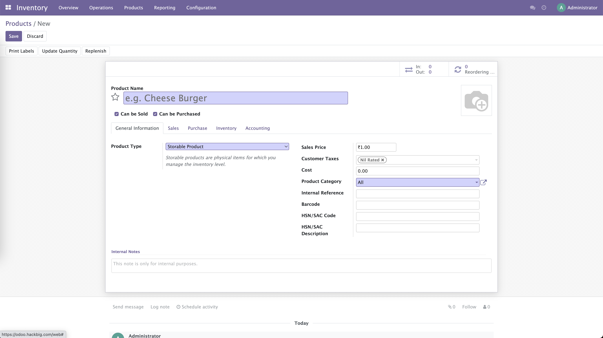

* Odoo Hiring Take Home Assignment
  * Problem Statement
    * We want to allow multiple product image uploads in the inventory module. 
    * In default case, you can add only a single image for a product. We want it to extend and make it select multiple images and first should become the default image for thumbnail.
    * When you click on the default image thumbnail then it should open a carousel to see all images.
    * In case of edit it should allow us to select the number of images which will be configured from settings.
    * Bonus to do: Add zoom for product thumbnail in listing, kanban and single product view.
  * Checklist for solution submission
    * Please setup odoo on local machine including database as well on local. Refer to this article https://www.odoo.com/documentation/15.0/administration/install/install.html
    * Create a new module having all the required modifications. Refer to this article https://www.odoo.com/documentation/15.0/developer/howtos/backend.html
    * Please try to use internet as much as you can to find solutions for all the problems that you encounter during the process. If no solution found and stuck then ping us.
    * At the time of submission, please create a working copy of module code and commit to a repository and send the link of repo and allow access to concerned. Please keep repo private.
* Please refer always to odoo developer guide - https://www.odoo.com/documentation/15.0/developer.html
